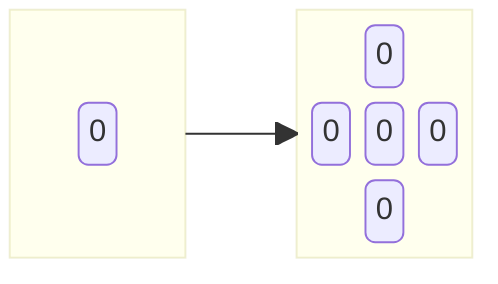
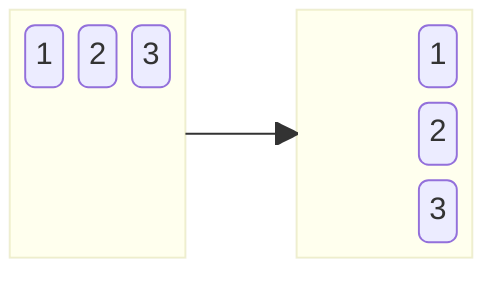

import { Card } from '@radix-ui/themes';

## 数组
### 加一
```js
function plusOne(digits: number[]): number[] {
    for (let i = digits.length - 1; i >= 0; i--) {
        digits[i] += 1
        if (digits[i] < 10) break
        else digits[i] = 0
    }
    if (digits[0] === 0) digits.unshift(1)

    return digits
};
```
### 轮转数组
1. 索引映射：`i` -> `(i + k) % len`
```js {4}
function rotate(nums: number[], k: number): void {
    let arr = nums.slice()
    for (let [i, v] of arr.entries()) {
        let index = (i + k) % nums.length
        nums[index] = v
    }
};
```
### 合并区间
1. 按区间起点排序
2. 当区间重叠时，进行合并
```js {6}
function merge(intervals: number[][]): number[][] {
    intervals.sort((a, b) => a[0] - b[0])
    let res = [intervals[0]]
    for (let [a, b] of intervals.slice(1)) {
        let [x, y] = res.at(-1)
        if (a <= y) { // 区间重叠
            res.at(-1)[1] = Math.max(b, y)
        } else {
            res.push([a, b])
        }
    }
    return res
};
```
## 矩阵
### 矩阵置零
<Card mt='5' style={{ padding: 0 }} variant="ghost">

</Card>
```js
function setZeroes(matrix: number[][]): void {
    let [row, col] = [matrix.length, matrix[0].length]

    // 纪录零点所在的行与列
    let zeroRows = new Set()
    let zeroCols = new Set()
    for (let i = 0; i < row; i++) {
        for (let j = 0; j < col; j++) {
            if (matrix[i][j] === 0) {
                zeroRows.add(i)
                zeroCols.add(j)
            }
        }
    }

    // 填充零
    for (let i = 0; i < row; i++) {
        for (let j = 0; j < col; j++) {
            if (zeroRows.has(i) || zeroCols.has(j)) {
                matrix[i][j] = 0
            }
        }
    }
};
```
### 旋转图像
> 相似题目：[转置矩阵](https://leetcode.cn/problems/transpose-matrix/description/)
<Card mt='5' style={{ padding: 0 }} variant="ghost">

</Card>
```ts
function rotate(matrix: number[][]): void {
    let [row, col] = [matrix.length, matrix[0].length]

    // 辅助矩阵
    let temp = Array(row).fill(0).map(() => Array(col).fill(0))
    for (let i = 0; i < row; i++) {
        for (let j = 0; j < col; j++) {
            temp[i][j] = matrix[i][j]
        }
    }

    // 映射
    for (let i = 0; i < row; i++) {
        for (let j = 0; j < col; j++) {
            matrix[j][col - i - 1] = temp[i][j]
        }
    }
};
```
### 螺旋矩阵
```ts
function spiralOrder(matrix: number[][]): number[] {
    let [row, col] = [matrix.length, matrix[0].length]
    let [l, t, r, b] = [0, 0, col - 1, row - 1]
    let res = []

    while (true) {
        // 从左到右
        for (let i = l; i <= r; i++) res.push(matrix[t][i])
        t++
        if (t > b) break

        // 从上到下
        for (let i = t; i <= b; i++) res.push(matrix[i][r])
        r--
        if (l > r) break

        // 从右到左
        for (let i = r; i >= l; i--) res.push(matrix[b][i])
        b--
        if (t > b) break

        // 从下到上
        for (let i = b; i >= t; i--) res.push(matrix[i][l])
        l++
        if (l > r) break
    }

    return res
};
```