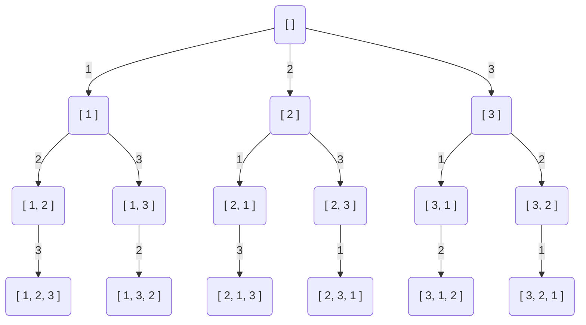
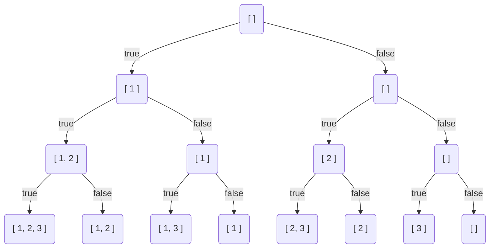
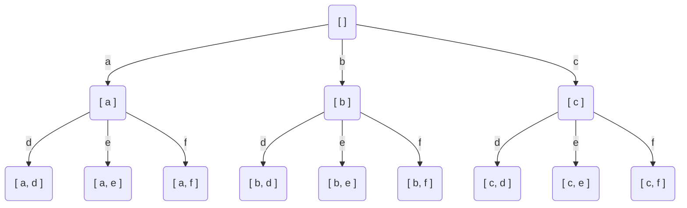

# 回朔
## 全排列

```js {7,11}
function permute(nums: number[]): number[][] {
    let res = []
    let path = []

    function dfs() {
        if (path.length === nums.length) {
            res.push(path.slice())
            return
        }

        let options = nums.filter(x => !path.includes(x)) // 未使用过的数字
        for (let val of options) {
            path.push(val)
            dfs()
            path.pop()
        }
    }

    dfs()
    return res
};
```
## 子集

```js {7,11}
function subsets(nums: number[]): number[][] {
    let res = []
    let path = []

    function dfs() {
        if (path.length === nums.length) {
            res.push(nums.filter((v, i) => path[i]))
            return
        }

        let options = [true, false] // 选或不选
        for (let val of options) {
            path.push(val)
            dfs()
            path.pop()
        }
    }

    dfs()
    return res
};
```
## 电话号码的字母组合

```js {11,15}
function letterCombinations(digits: string): string[] {
    if (digits === '') return []
    let map = ["abc", "def", "ghi", "jkl", "mno", "pqrs", "tuv", "wxyz"]
    let arr = digits.split('').map(x => map[Number(x) - 2])

    let res = []
    let path = []

    function dfs() {
        if (path.length === arr.length) {
            res.push(path.join(''))
            return
        }

        let options = arr[path.length] // 下一个组合
        for (let val of options) {
            path.push(val)
            dfs()
            path.pop()
        }
    }

    dfs()
    return res
};
```