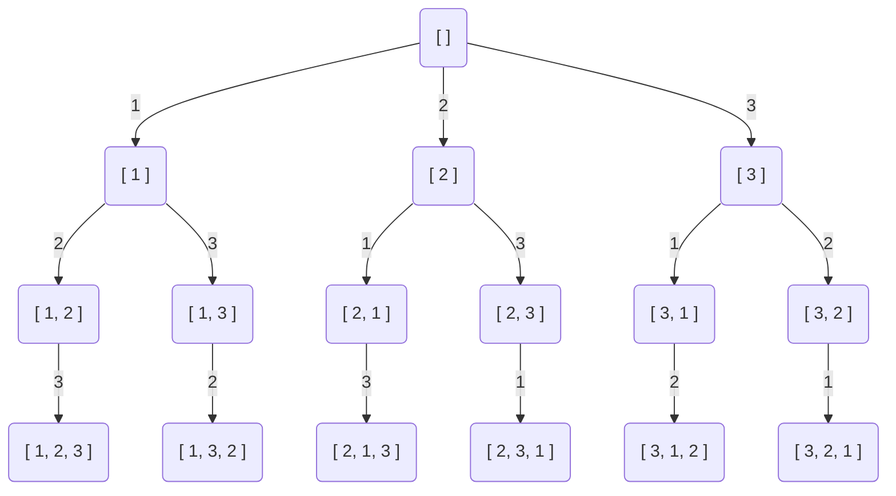
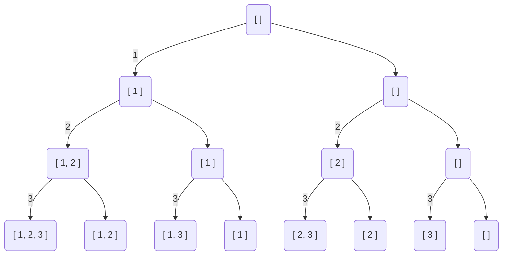
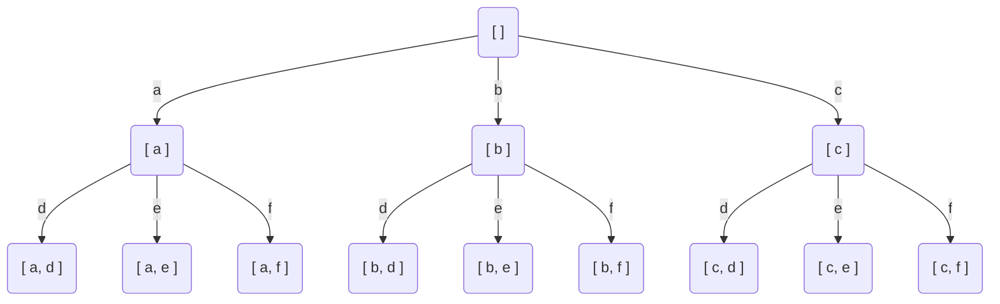

# 回朔
## 全排列

```js
function permute(nums: number[]): number[][] {
    function dfs(x) {
        if (x === nums.length) {
            res.push(path.slice())
            return
        }
        
        let unVisited = nums.filter(x => !path.includes(x))
        for (let val of unVisited) {
            path.push(val) // 选择未访问过的元素
            dfs(x + 1)
            path.pop()
        }
    }
    
    let res = []
    let path = []
    dfs(0)
    return res
};
```
## 子集

```js
function subsets(nums: number[]): number[][] {
    function dfs(x) {
        if (x === nums.length) {
            res.push(path.slice())
            return
        }

        dfs(x + 1) // 不选
        path.push(nums[x]) // 选
        dfs(x + 1)
        path.pop()
    }

    let res = []
    let path = []
    dfs(0)
    return res
};
```
## 电话号码的字母组合

```js
function letterCombinations(digits: string): string[] {
    let map = ["abc", "def", "ghi", "jkl", "mno", "pqrs", "tuv", "wxyz"]
    let arr = digits.split('').map(x => map[Number(x) - 2])
    if (digits === '') return []
    
    function dfs(x) {
        if (x === arr.length) {
            res.push(path.join(''))
            return
        }

        for (let v of arr[x]) {
            path.push(v)
            dfs(x + 1)
            path.pop()
        }
    }

    let res = []
    let path = []
    dfs(0)
    return res
};
```