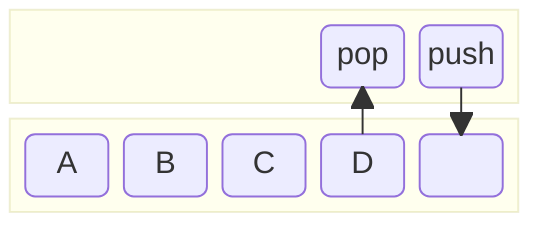
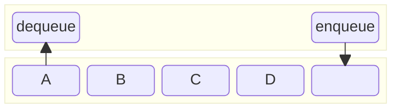
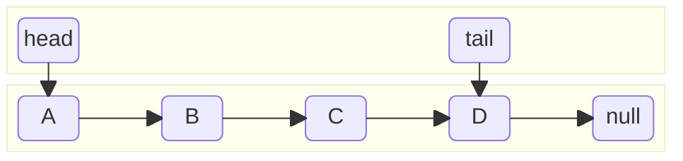

import { Table } from '@radix-ui/themes'

# Data Structure
## Stack

<Table.Root variant='surface' mt='20px'>
  <Table.Header>
    <Table.Row>
      <Table.ColumnHeaderCell>Methods</Table.ColumnHeaderCell>
      <Table.ColumnHeaderCell justify='center'>ArrayStack</Table.ColumnHeaderCell>
      <Table.ColumnHeaderCell justify='center'>LinkedStack</Table.ColumnHeaderCell>
    </Table.Row>
  </Table.Header>

  <Table.Body>
    <Table.Row>
      <Table.Cell>push</Table.Cell>
      <Table.Cell justify='center'>$O(1)$</Table.Cell>
      <Table.Cell justify='center'>$O(1)$</Table.Cell>
    </Table.Row>
    <Table.Row>
      <Table.Cell>pop</Table.Cell>
      <Table.Cell justify='center'>$O(1)$</Table.Cell>
      <Table.Cell justify='center'>$O(1)$</Table.Cell>
    </Table.Row>
    <Table.Row>
      <Table.Cell>peek</Table.Cell>
      <Table.Cell justify='center'>$O(1)$</Table.Cell>
      <Table.Cell justify='center'>$O(1)$</Table.Cell>
    </Table.Row>
    <Table.Row>
      <Table.Cell>size</Table.Cell>
      <Table.Cell justify='center'>$O(1)$</Table.Cell>
      <Table.Cell justify='center'>$O(1)$</Table.Cell>
    </Table.Row>
    <Table.Row>
      <Table.Cell>isEmpty</Table.Cell>
      <Table.Cell justify='center'>$O(1)$</Table.Cell>
      <Table.Cell justify='center'>$O(1)$</Table.Cell>
    </Table.Row>    
  </Table.Body>
</Table.Root>
### ArrayStack
```js
class ArrayStack {
    constructor() {
        this.list = []
    }
    
    push(val) {
        this.list.push(val)
    }
    
    pop() {
        return this.list.pop()
    }

    peek() {
        return this.list.at(-1)
    }
    
    size() {
        return this.list.length
    }

    isEmpty() {
        return this.list.length === 0
    }
}
```
### LinkedStack
[SinglyLinkedList](#singlylinkedlist)
```js
class LinkedStack {
    constructor() {
        this.list = new SinglyLinkedList()
    }
    
    push(val) {
        this.list.unshift(val)
    }
    
    pop() {
        if (this.list.size) {
            let val = this.list.head.val
            this.list.shift()
            return val
        } else {
            return undefined
        }
    }

    peek() {
        if (this.list.size) {
            return this.list.head.val
        } else {
            return undefined
        }
    }
    
    size() {
        return this.list.size
    }

    isEmpty() {
        return this.list.size === 0
    }
}
```
## Queue

<Table.Root variant='surface' mt='20px'>
  <Table.Header>
    <Table.Row>
      <Table.ColumnHeaderCell>Methods</Table.ColumnHeaderCell>
      <Table.ColumnHeaderCell justify='center'>ArrayQueue</Table.ColumnHeaderCell>
      <Table.ColumnHeaderCell justify='center'>LinkedQueue</Table.ColumnHeaderCell>
    </Table.Row>
  </Table.Header>

  <Table.Body>
    <Table.Row>
      <Table.Cell>enqueue</Table.Cell>
      <Table.Cell justify='center'>$O(1)$</Table.Cell>
      <Table.Cell justify='center'>$O(1)$</Table.Cell>
    </Table.Row>
    <Table.Row>
      <Table.Cell>dequeue</Table.Cell>
      <Table.Cell justify='center'>$O(n)$</Table.Cell>
      <Table.Cell justify='center'>$O(1)$</Table.Cell>
    </Table.Row>
    <Table.Row>
      <Table.Cell>front</Table.Cell>
      <Table.Cell justify='center'>$O(1)$</Table.Cell>
      <Table.Cell justify='center'>$O(1)$</Table.Cell>
    </Table.Row>
    <Table.Row>
      <Table.Cell>size</Table.Cell>
      <Table.Cell justify='center'>$O(1)$</Table.Cell>
      <Table.Cell justify='center'>$O(1)$</Table.Cell>
    </Table.Row>
    <Table.Row>
      <Table.Cell>isEmpty</Table.Cell>
      <Table.Cell justify='center'>$O(1)$</Table.Cell>
      <Table.Cell justify='center'>$O(1)$</Table.Cell>
    </Table.Row>    
  </Table.Body>
</Table.Root>
### ArrayQueue
```js
class ArrayQueue {
    constructor() {
        this.list = []
    }

    enqueue(val) {
        this.list.push(val)
    }

    dequeue() {
        return this.list.shift()
    }
    
    front() {
        return this.list[0]
    }
    
    size() {
        return this.list.length
    }

    isEmpty() {
        return this.list.length === 0
    }
}
```
### LinkedQueue
[SinglyLinkedList](#singlylinkedlist)
```js
class LinkedQueue {
    constructor() {
        this.list = new SinglyLinkedList()
    }

    enqueue(val) {
        this.list.push(val)
    }

    dequeue() {
        if (this.list.size) {
            let val = this.list.head.val
            this.list.shift()
            return val
        } else {
            return undefined
        }
    }
    
    front() {
        if (this.list.size) {
            return this.list.head.val
        } else {
            return undefined
        }
    }
    
    size() {
        return this.list.size
    }

    isEmpty() {
        return this.list.size === 0
    }
}
```
## LinkedList

<Table.Root variant='surface' mt='20px'>
  <Table.Header>
    <Table.Row>
      <Table.ColumnHeaderCell>Methods</Table.ColumnHeaderCell>
      <Table.ColumnHeaderCell justify='center'>SinglyLinkedList</Table.ColumnHeaderCell>
      <Table.ColumnHeaderCell justify='center'>DoublyLinkedList</Table.ColumnHeaderCell>
    </Table.Row>
  </Table.Header>

  <Table.Body>
    <Table.Row>
      <Table.Cell>unshift</Table.Cell>
      <Table.Cell justify='center'>$O(1)$</Table.Cell>
      <Table.Cell justify='center'>$O(1)$</Table.Cell>
    </Table.Row>
    <Table.Row>
      <Table.Cell>push</Table.Cell>
      <Table.Cell justify='center'>$O(1)$</Table.Cell>
      <Table.Cell justify='center'>$O(1)$</Table.Cell>
    </Table.Row>
    <Table.Row>
      <Table.Cell>shift</Table.Cell>
      <Table.Cell justify='center'>$O(1)$</Table.Cell>
      <Table.Cell justify='center'>$O(1)$</Table.Cell>
    </Table.Row>
    <Table.Row>
      <Table.Cell>pop</Table.Cell>
      <Table.Cell justify='center'>$O(n)$</Table.Cell>
      <Table.Cell justify='center'>$O(1)$</Table.Cell>
    </Table.Row> 
  </Table.Body>
</Table.Root>
### SinglyLinkedList
```js
class ListNode {
    constructor(val, next) {
        this.val = val
        this.next = next
    }
}

class SinglyLinkedList {
    constructor() {
        this.head = null
        this.tail = null
        this.size = 0
    }

    unshift(val) {
        let node = new ListNode(val, this.head)
        if (this.size) {
            this.head = node
        } else {
            this.head = node
            this.tail = node
        }
        this.size++
    }

    push(val) {
        let node = new ListNode(val, null)
        if (this.size) {
            this.tail.next = node
            this.tail = node
        } else {
            this.head = node
            this.tail = node
        }
        this.size++
    }

    shift() {
        if (this.size) {
            this.head = this.head.next
            this.size--
        }
    }
}
```
### DoublyLinkedList
```js
class ListNode {
    constructor(val, prev, next) {
        this.val = val
        this.prev = prev
        this.next = next
    }
}

class DoublyLinkedList {
    constructor() {
        this.head = null
        this.tail = null
        this.size = 0
    }

    unshift(val) {
        let node = new ListNode(val, null, this.head)
        if (this.size) {
            this.head.prev = node
            this.head = node
        } else {
            this.head = node
            this.tail = node
        }
        this.size++
    }

    push(val) {
        let node = new ListNode(val, this.tail, null)
        if (this.size) {
            this.tail.next = node
            this.tail = node
        } else {
            this.head = node
            this.tail = node
        }
        this.size++
    }

    shift() {
        if (this.size) {
            this.head = this.head.next
            this.head.prev = null
            this.size--
        }
    }

    pop() {
        if (this.size) {
            this.tail = this.tail.prev
            this.tail.next = null
            this.size--
        }
    }
}
```