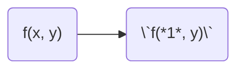
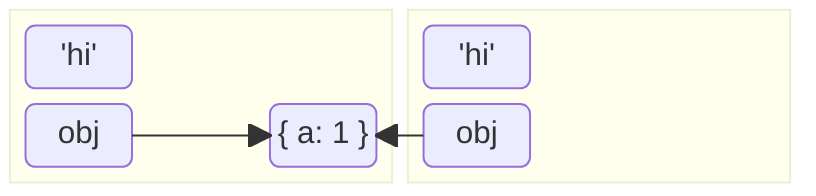
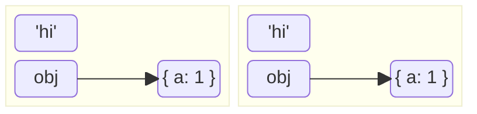

import { Picture } from '@/components'

# Lodash
## Throttle
<Picture src="/img/coding/lodash/throttle.png" />
1. 调用函数后，设置冷却时间
2. 冷却时间内再次调用，什么也不做
```js
function throttle(fn, wait) {
    let id
    return function(...args) {
        if (!id) {
            fn.apply(this, args)
            id = setTimeout(() => {id = null}, wait) // 设置冷却时间
        }
    }
}
```
## Debounce
<Picture src="/img/coding/lodash/debounce.png" />
1. 调用函数后，设置冷却时间
2. 冷却时间内再次调用，什么也不做，并重置冷却时间
```js
function debounce(fn, wait) {
    let id
    return function(...args) {
        if (!id) {
            fn.apply(this, args)
            id = setTimeout(() => {id = null}, wait) // 设置冷却时间
        } else {
            clearTimeout(id)// 重置冷却时间
            id = setTimeout(() => {id = null}, wait)
        }
    }
}
```
## Memoize
1. 调用函数时，若有缓存，就使用缓存
2. 若无缓存，则返回计算结果，并将结果缓存
```js
function memoize(fn) {
    let cache = new Map() // Map<string, any>
    return function(...args) {
        let key = JSON.stringify(args)
        if (cache.has(key)) {
            return cache.get(key)
        } else {
            let val = fn.apply(this, args)
            cache.set(key, val)
            return val
        }
    }
}
```
## Curry

```js
function curry(fn) {
    return function curried(...args) {
        if (args.length === fn.length) {
            return fn.call(this, ...args)
        } else {
            return function(...rest) {
                return curried.call(this, ...args, ...rest)
            }
        }
    }
}
```
## Clone Shallow

1. 基础类型：拷贝值
2. 对象类型：拷贝地址
```js {4}
function cloneShallow(obj) {
    let clone = obj instanceof Array ? [] : {}
    for (let [key, val] of Object.entries(obj)) {
        clone[key] = val
    }
    return clone
}
```
## Clone Deep

1. 基础类型：拷贝值
2. 对象类型：拷贝值
```js {5,7}
function cloneDeep(obj) {
    let clone = obj instanceof Array ? [] : {}
    for (let [key, val] of Object.entries(obj)) {
        if (val instanceof Object) {
            clone[key] = cloneDeep(val)
        } else {
            clone[key] = val
        }
    }
    return clone
}
```