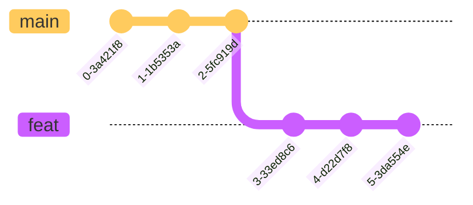

import { Callout } from 'nextra/components'

# Checkout & Reset
## Checkout
### 切换分支

1. 在 `main` 分支上执行 `git checkout feat{:sh}` 命令，切换到 `feat` 分支
### 新建分支并切换
1. 在 `main` 分支上执行 `git checkout -b feat{:sh}` 命令，新建 `feat` 分支，并切换到该分支
<Callout type='info' emoji='🐳'>
等价于 `git branch feat{:sh}` + `git checkout feat{:sh}`
</Callout>