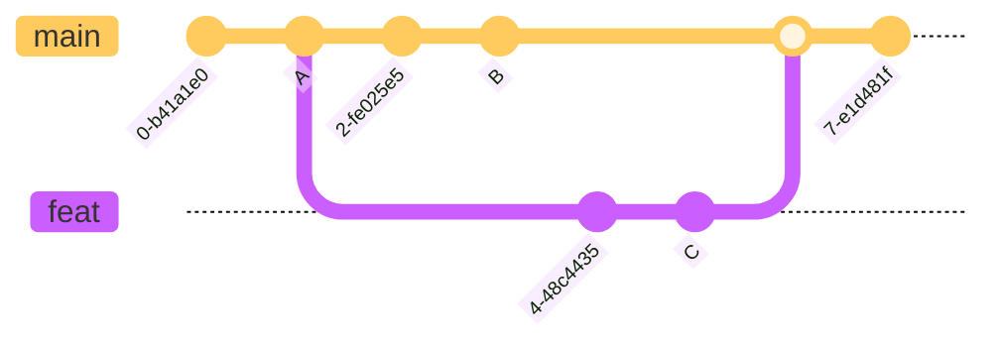
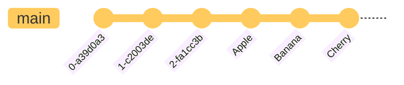
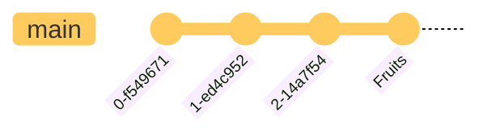
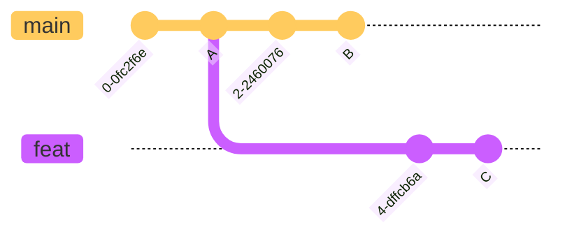
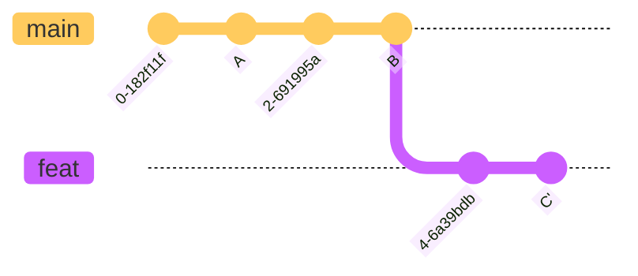
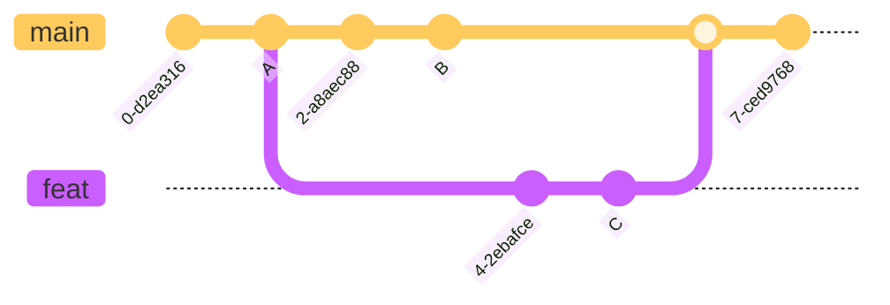
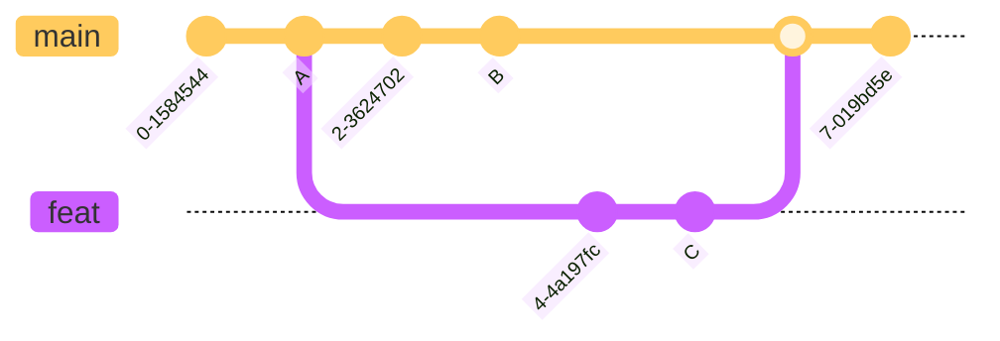
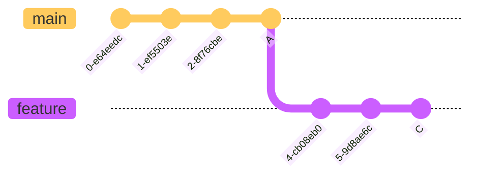

import { Picture } from '@/components'
import { Callout } from 'nextra/components'
import { Table, Flex, Box } from '@radix-ui/themes';

# Merge & Rebase
## Merge
### 合并两个分支

1. 在 `main` 分支上执行 `git merge feat{:sh}` 命令，将 `feat` 合入 `main`
2. Git 会将 `A`, `B`, `C` 做一个[三方合并](#三方合并)，然后提交合并的结果
<Callout type='info' emoji='🐳'>
提交历史是非线性的，并且会引入一次新的提交。
</Callout>
## Rebase
### 合并多个提交

1. 使用 `git rebase -i HEAD~3{:sh}` 命令，合并最近三个提交

<Callout type='info' emoji='🐳'>
常用来清理提交历史。
</Callout>
### 线性三方合并

1. 首先在 `feat` 分支上执行 `git rebase main{:sh}` 命令，将 `feat` 分支变基到 `main` 分支

2. 然后在 `main` 分支上执行 `git merge feat{:sh}` 命令，Git 会将 `A`, `B`, `C` 做一个[快速合并](#快速合并)
<Callout type='info' emoji='🐳'>
提交历史是线性的，但需要解决多次冲突。
</Callout>
## Appendix
### 两方合并

我们想要将 `feat` 合入 `main`，但是仅仅对比 `B`, `C` ，我们无法知道是谁修改了文件，所以只能手动合并
### 三方合并

三方合并引入了 `B`, `C` 的共同父节点 `A`，可以找出修改的文件，因此可以自动合并

<Table.Root variant="surface" style={{ marginTop: "10px" }}>
  <Table.Header>
    <Table.Row>
      <Table.ColumnHeaderCell>Diff</Table.ColumnHeaderCell>
      <Table.ColumnHeaderCell>Result</Table.ColumnHeaderCell>
    </Table.Row>
  </Table.Header>

  <Table.Body>
    <Table.Row>
      <Table.Cell>`A` = `B` = `C`</Table.Cell>
      <Table.Cell>内容无修改</Table.Cell>
    </Table.Row>
    <Table.Row>
      <Table.Cell>`A` = `B` ≠ `C`</Table.Cell>
      <Table.Cell>`C` 进行了修改，保留 `C`</Table.Cell>
    </Table.Row>
    <Table.Row>
      <Table.Cell>`A` = `C` ≠ `B`</Table.Cell>
      <Table.Cell>`B` 进行了修改，保留 `B`</Table.Cell>
    </Table.Row>
    <Table.Row>
      <Table.Cell>`B` = `C` ≠ `A`</Table.Cell>
      <Table.Cell>`B`, `C` 进行了相同的修改，保留 `B` 或 `C`</Table.Cell>
    </Table.Row>
    <Table.Row>
      <Table.Cell>`A` ≠ `B` ≠ `C`</Table.Cell>
      <Table.Cell>发生冲突，手动保留</Table.Cell>
    </Table.Row>
  </Table.Body>
</Table.Root>
### 快速合并

做三方合并时，如果 `main` 上没有新的提交，就不会产生冲突，Git 会直接将 `main` 指针前移到 `C`
<Callout type='info' emoji='🐳'>
快速合并不会产生新的提交，并且记录是线性的。
</Callout>