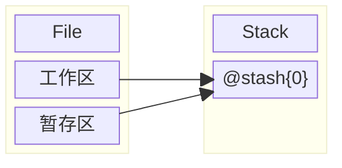
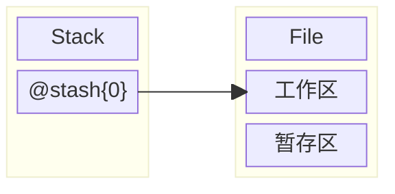

import { Callout } from 'nextra/components'

# Tools
## Stash
### 保存工作内容
1. 使用 `git stash{:sh}` 命令， 移动当前**工作区**和**暂存区**的内容到**栈**

<Callout type='info' emoji='🐳'>
使用 `git stash -m 'hello'{:sh}` 命令，指定**栈**元素的标题
</Callout>
2. 使用 `git stash list'{:sh}` 命令，查看**栈**元素
### 恢复工作内容
1. 使用 `git stash pop{:sh}` 命令，将**栈顶**元素*弹出*到**工作区**

<Callout type='info' emoji='🐳'>
使用 `git stash pop 1{:sh}` 命令，指定弹出指定位置元素
</Callout>
2. 使用 `git stash apply{:sh}` 命令，将**栈顶**元素*复制*到**工作区**

<Callout type='info' emoji='🐳'>
使用 `git stash apply 1{:sh}` 命令，指定复制指定位置元素
</Callout>