import { Callout } from 'nextra/components'
import { Table } from '@radix-ui/themes';

# Array
## Creating an Array
### literals
- **描述**：创建数组
```js
let arr = []        // []
let arr = [,,,]     // [empty × 3]
let arr = [1, 2, 3] // [1, 2, 3]
```
### spread operator
- **描述**：从*可迭代对象*创建数组
```js
[...'abc'] // ['a', 'b', 'c']
```
### Array()
- **描述**：创建数组
- **语法**：`Array(length){:js}`, `Array(...elements){:js}`
```js
Array()        // []
Array(3)       // [empty × 3]
Array(1, 2, 3) // [1, 2, 3]
```
### of()
- **描述**：创建数组
- **语法**：`Array.of(...elements){:js}`
```js
Array.of()        // []
Array.of(3)       // [3]
Array.of(1, 2, 3) // [1, 2, 3]
```
<Callout type="info" emoji="️🐳">
解决了 [Array()](#array) 不能创建单元素数组的问题
</Callout>
### from()
- **描述**：从*可迭代对象*或*类数组*创建数组
- **语法**：`Array.from(arrayLike, mapFn?, thisArg?){:js}`
```js
// 可迭代对象
Array.from('hello') // ['h', 'e', 'l', 'l', 'o']

// 类数组
Array.from({ 0: 'a', 1: 'b', length: 2 }) // ['a', 'b']

// 映射函数
Array.from('123', x => Number(x)) // [1, 2, 3]
```
## Accessing an Array
### subscript
- **描述**：访问索引位置元素
```js
[1, 2, 3][0] // 1
```
### at()
- **描述**：访问索引位置元素
- **语法**：`at(index){:js}`
```js
// positive index
[1, 2, 3].at(0)  // 1

// negative index
[1, 2, 3].at(-1) // 3
```
<Callout type="info" emoji="️🐳">
解决了 [subscript](#subscript-operator) 不能访问负索引问题
</Callout>
## Modifying an Array
### push()
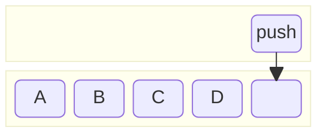
- **描述**：添加元素到数组末尾，并返回新数组长度
- **语法**：`push(...elements){:js}`
- **时间**：$O(1)$
```js
[1, 2].push(3)    // Return 3, Array is [1, 2, 3]
[1, 2].push(3, 4) // Return 4, Array is [1, 2, 3, 4]
```
### pop()
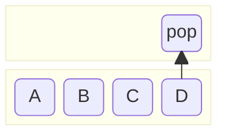
- **描述**：删除数组末尾元素，并返回该元素
- **语法**：`pop(){:js}`
- **时间**：$O(1)$
```js
[1, 2].pop() // Return 2, Array is [1]
```
### unshift
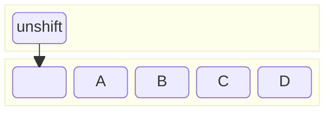
- **描述**：添加元素到数组开头，并返回新数组长度
- **语法**：`unshift(...elements){:js}`
- **时间**：$O(n)$
```js
[2, 3].unshift(1)    // Return 3, Array is [1, 2, 3]
[2, 3].unshift(0, 1) // Return 4, Array is [0, 1, 2, 3]
```
### shift()
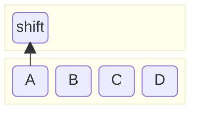
- **描述**：删除数组开头元素，并返回该元素
- **语法**：`shift(){:js}`
- **时间**：$O(1)$
```js
[1, 2].shift() // Return 1, Array is [2]
```
### splice()
- **描述**：修改数组，并返回被删除的元素
- **语法**：`splice(start, deleteCount?, ...elements){:js}`
	- `start{:js}`：操作位置
  - `deleteCount=Infinity{:js}`：删除元素的个数
  - `elements{:js}`：插入的元素
- **时间**：$O(n)$
```js
// remove
[1, 2, 3].splice(1)    // Return [2, 3], Array is [1]
[1, 2, 3].splice(1, 1) // Return [2], Array is [1, 3]

// insert
[1, 2, 3].splice(1, 0, 'a')      // Return [], Array is [1, 'a', 2, 3]
[1, 2, 3].splice(1, 0, 'a', 'b') // Return [], Array is [1, 'a', 'b', 2, 3]

// remove and insert
[1, 2, 3].splice(1, 2, 'a', 'b') // Return [2, 3], Array is [1, 'a', 'b']
```
## Iterating an Array
<Table.Root variant="surface">
  <Table.Header>
    <Table.Row>
      <Table.ColumnHeaderCell><></></Table.ColumnHeaderCell>
      <Table.ColumnHeaderCell align='center'>for loop</Table.ColumnHeaderCell>
      <Table.ColumnHeaderCell align='center'>for of loop</Table.ColumnHeaderCell>
      <Table.ColumnHeaderCell align='center'>forEach</Table.ColumnHeaderCell>
    </Table.Row>
  </Table.Header>

  <Table.Body>
    <Table.Row>
      <Table.Cell>continue</Table.Cell>
      <Table.Cell align='center'>✅</Table.Cell>
      <Table.Cell align='center'>✅</Table.Cell>
      <Table.Cell align='center'>❌</Table.Cell>
    </Table.Row>

    <Table.Row>
      <Table.Cell>break</Table.Cell>
      <Table.Cell align='center'>✅</Table.Cell>
      <Table.Cell align='center'>✅</Table.Cell>
      <Table.Cell align='center'>❌</Table.Cell>
    </Table.Row>
    
    <Table.Row>
      <Table.Cell>return</Table.Cell>
      <Table.Cell align='center'>✅</Table.Cell>
      <Table.Cell align='center'>✅</Table.Cell>
      <Table.Cell align='center'>❌</Table.Cell>
    </Table.Row>

    <Table.Row>
      <Table.Cell>skip</Table.Cell>
      <Table.Cell align='center'>✅</Table.Cell>
      <Table.Cell align='center'>❌</Table.Cell>
      <Table.Cell align='center'>❌</Table.Cell>
    </Table.Row>

    <Table.Row>
      <Table.Cell>hole</Table.Cell>
      <Table.Cell align='center'>❌</Table.Cell>
      <Table.Cell align='center'>❌</Table.Cell>
      <Table.Cell align='center'>✅</Table.Cell>
    </Table.Row>
  </Table.Body>
</Table.Root>
### for loop
- **描述**：遍历数组
```js
let arr = [1, 2, 3]
for (let i = 0; i < arr.length; i++) {
  console.log(arr[i])
}
```
### for of loop
- **描述**：遍历数组
```js
let arr = [1, 2, 3]
for (let val of arr) {
  console.log(val)
}
```
### forEach()
- **描述**：遍历数组
- **语法**：`forEach(fn(v, i, a), thisArg?){:js}`
```js
let arr = [1, 2, 3]
arr.forEach((x) => {
  console.log(x)
})
```
## Transforming an Array
### map()
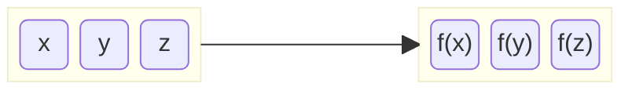
- **描述**：映射数组元素
- **语法**：`map(fn(v, i, a), thisArg?){:js}`
```js
// 基本
[1, 2, 3].map((x) => x * 2)      // [2, 4, 6]
[1, 2, 3].map((x, i) => i)       // [0, 1, 2]
[1, 2, 3].map((x, i, a) => a[0]) // [1, 1, 1]

// 跳过空槽
[1,  , 3].map(x => x) // [1, empty, 3]

// 类数组
let arrayLike = { 0: 'a', 1: 'b', length: 2 }
Array.prototype.map.call(arrayLike, x => x) // ['a', 'b']
```
### filter()
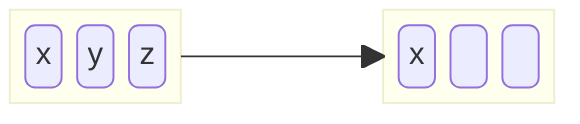
- **描述**：返回一个数组，包含了满足条件的值
- **语法**：`filter(fn(v, i, a), thisArg?){:js}`
```js
[1, 2, 3].filter(x => x > 0) // [1, 2, 3]
```
### reduce()
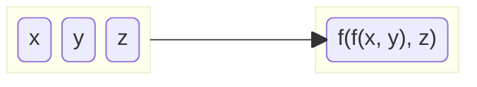
- **描述**：合并数组元素
- **语法**：`reduce(fn(p, v, i, a), initialValue?){:js}`
```js
// 基础
[1, 2, 3].reduce((a, b) => a + b)     // 6
[1, 2, 3].reduce((a, b) => a + b, 10) // 16

// 跳过空槽
[1,  , 3].reduce((a, b) => a + b) // 4
```
### flat()
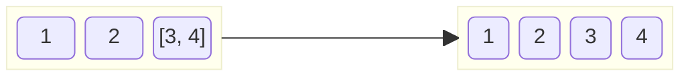
- **描述**：原地展平数组，并返回新数组
- **语法**：`flat(depth?){:js}`
```js
[1, [2, [3]]].flat(1) // [1, 2, [3]]
[1, [2, [3]]].flat(2) // [1, 2, 3]
```
### flatMap()
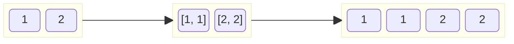
- **描述**：映射数组元素，然后展平一层
- **语法**：`flatMap(fn(v, i, a), thisArg?){:js}`
```js
[1, 2, 3].flatMap(x => [x, x]) // [1, 1, 2, 2, 3, 3]
```
## Searching an Array
### find()
- **描述**：返回首个满足条件的元素
- **语法**：`find(fn(v, i, a), thisArg?){:js}`
```js
[1, 2, 3].find(x => x > 0) // 1
[1, 2, 3].find(x => x < 0) // undefined
```
### findIndex()
- **描述**：返回首个满足条件元素的索引
- **语法**：`findIndex(fn(v, i, a), thisArg?){:js}`
```js
[1, 2, 3].findIndex(x => x > 0) // 0
[1, 2, 3].findIndex(x => x < 0) // -1
```
### indexOf()
- **描述**：返回元素首次出现的索引
- **语法**：`indexOf(value, start?){:js}`
```js
[1, 2, 3].indexOf(1) // 0
[1, 2, 3].indexOf(0) // -1
```
### includes()
- **描述**：是否包含某个元素
- **语法**：`includes(value, start?){:js}`
```js
[1, 2, 3].includes(1) // true
[1, 2, 3].includes(0) // false
```
### every()
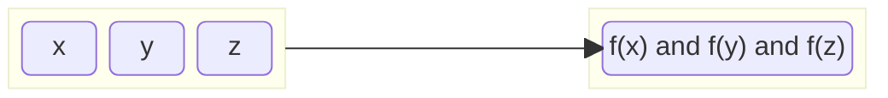
- **描述**：是否所有元素都满足条件
- **语法**：`every(fn(v, i, a), thisArg?){:js}`
```js
[1, 2, 3].every(x => x > 0) // true
```
### some()
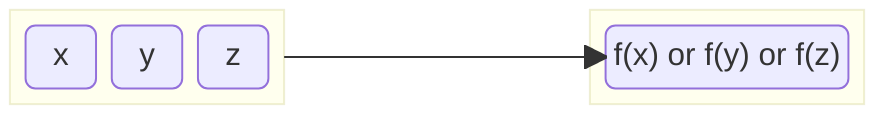
- **描述**：是否存在一个元素满足条件
- **语法**：`some(fn(v, i, a), thisArg?){:js}`
```js
[1, 2, 3].some(x => x < 0) // false
```
## Sorting an Array
### sort()
- **描述**：原地排序数组，并返回该数组
- **语法**：`sort(compareFn?){:js}`
- **参数**
	- `compareFn(a, b){:js}`：排序函数，默认会转化为字符串，按 UTF-16 码排序
        - `f(a, b) < 0`：a 在前
        - `f(a, b) === 0`：顺序不变
```js
[1, 2, 10].sort() // [1, 10, 2]
[1, 2, 10].sort((a, b) => a - b) // [1, 2, 10]
```
### reverse()
- **描述**：原地反转数组，并返回该数组
- **语法**：`reverse(){:js}`
```js
[1, 2, 3].reverse() // [3, 2, 1]
```
## Enumerating an Array
### keys()
- **描述**：返回一个迭代器，包含元素的键
- **语法**：`keys(){:js}`
```js
[1, 2, 3].keys() // Iterator is [0, 1, 2]
```
### values()
- **描述**：返回一个迭代器，包含元素的值
- **语法**：`values(){:js}`
```js
[1, 2, 3].values() // Iterator is [1, 2, 3]
```
### entries()
- **描述**：返回一个迭代器，包含元素的键值对
- **语法**：`entries(){:js}`
```js
[1, 2, 3].entries() // Iterator is [[0, 1], [1, 2], [2, 3]]
```
## Copying an Array
### slice()
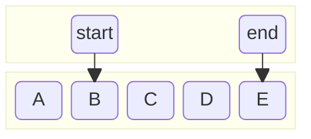
- **描述**：返回拷贝后的数组
- **语法**：`slice(start?, end?){:js}`
```js
[1, 2, 3].slice()     // [1, 2, 3]
[1, 2, 3].slice(1)    // [2, 3]
[1, 2, 3].slice(1, 2) // [2]
```
### concat()
- **描述**：返回拼接后的数组
- **语法**：`concat(...elements){:js}`
```js
// 基础
[1, 2].concat()     // [1, 2]
[1, 2].concat(3, 4) // [1, 2, 3, 4]

// 自动展平一层
[1, 2].concat([3], [4]) // [1, 2, 3, 4]
```
## Checking an Array
### isArray()
- **描述**：判断是否是数组
- **语法**：`Array.isArray(value){:js}`
```js
Array.isArray([]) // true
```
### prototype
- **描述**：判断是否是数组
```js
[] instanceof Array // true
[].constructor === Array // true
```
### toString
- **描述**：判断是否是数组
```js
Object.prototype.toString.call([]).slice(8,-1) === 'Array' // true
```